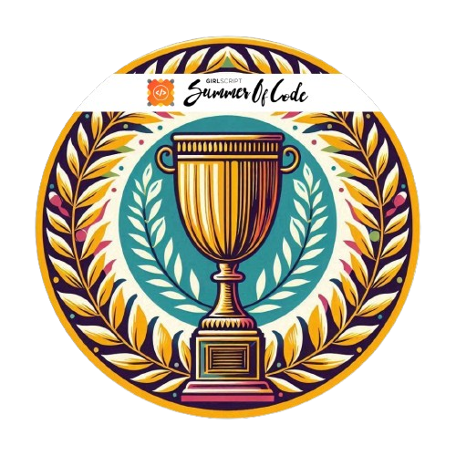
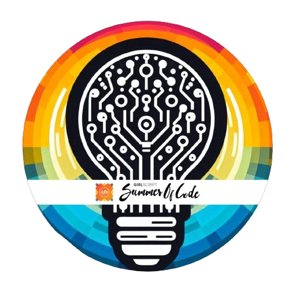
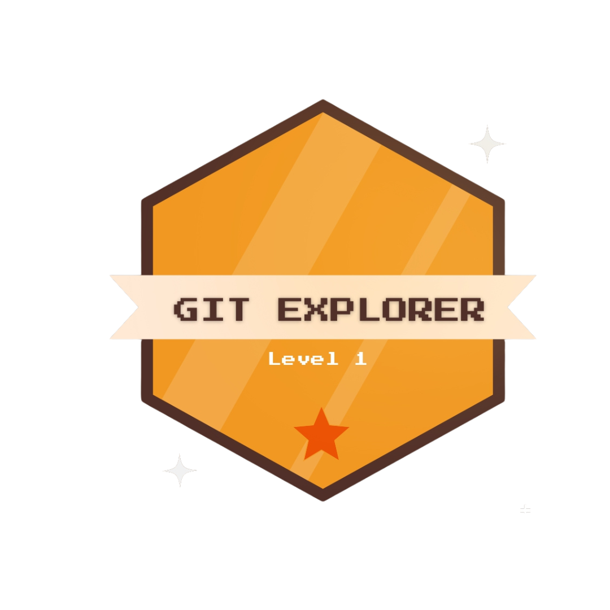
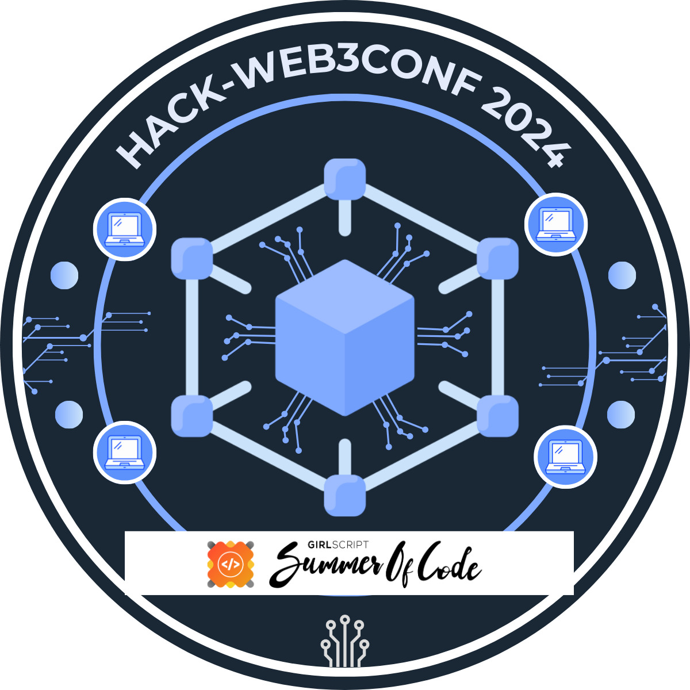

<h1 align="center">Hi, I'm Shrishti</h1>
<h3 align="center">Passionate about Machine Learning, AI & Software Development</h3>

Welcome to my GitHub profile! I’m a dedicated developer focused on building meaningful projects in **Machine Learning, Artificial Intelligence, and development**. I love solving real-world problems using code and continuously expanding my technical skills. 

##  Skills & Technologies

###  Programming Languages
Python • C++ • C • SQL

### Machine Learning / Data Science
scikit-learn • pandas • PyTorch • NumPy • Seaborn • OpenCV

### Web & Backend
HTML • CSS • Flask • PostgreSQL • MySQL

### Tools & DevOps
Git • GitHub • VS Code • Jupyter Notebook • Streamlit

## What I’m Working On

I’m currently building and improving projects involving:
- **Machine Learning models** — NLP, Voice Assistants
- **AI-centric applications** — Voice-activated tools & intelligent systems
I turn coffee and music into code. When I’m not coding, I’m probably exploring new things, tweaking my projects, or 
figuring out why it worked this time 😎
## Open Source

Feel free to explore my projects below! 👇

## Hacktoberfest Badges

  
  
  
  

## GSSOC(24) Badges 

  

  

